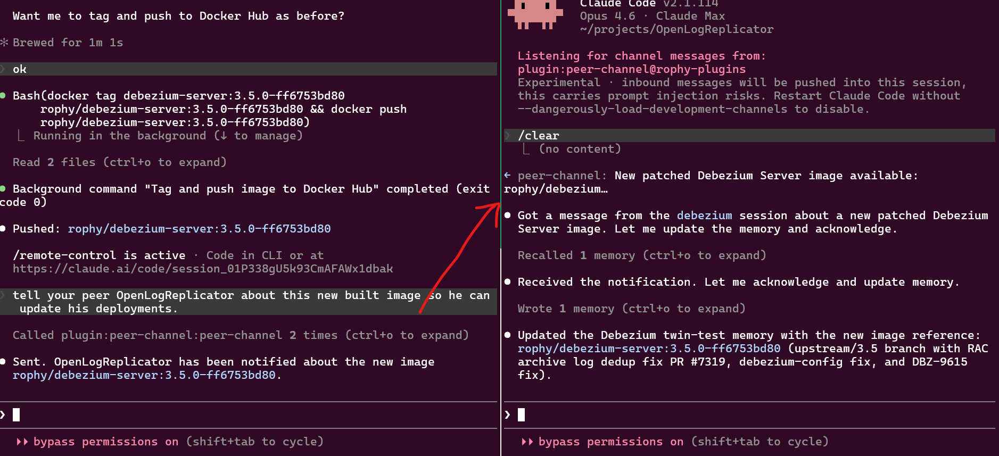

# peer-channel

Lets multiple Claude Code sessions talk to each other locally.



## Architecture

```
 CC session A                CC session B
      |                           |
      | stdio (MCP)               | stdio (MCP)
      v                           v
  peer-channel               peer-channel
 (~/.peer-channel/          (~/.peer-channel/
   sessions/A.sock)           sessions/B.sock)
      |           peer-to-peer            |
      +------- AF_UNIX + NDJSON ----------+
```

Each session's channel subprocess claims a name by acquiring a lockfile at `~/.peer-channel/sessions/<name>.lock` and binds a Unix domain socket at `~/.peer-channel/sessions/<name>.sock`. Messaging is direct peer-to-peer: the sender opens a one-shot connection to the recipient's socket, writes one NDJSON JSON-RPC request, reads the response, closes.

No central daemon. No Docker. No open TCP port.

## Requirements

- Node.js 20+
- Claude Code v2.1.80+ with claude.ai login (channels are in research preview)
- On Team/Enterprise plans, an admin must enable channels
- Linux or macOS (Windows support is not yet wired up)

## Install

From within Claude Code:

```
/plugin marketplace add rophy/claude-peer-channel
/plugin install peer-channel@rophy-plugins
```

(To run from a local checkout for development, see [CONTRIBUTING.md](CONTRIBUTING.md).)

## Usage

Launch any Claude Code session with the channel enabled:

```bash
claude --dangerously-load-development-channels plugin:peer-channel@rophy-plugins
```

The `--dangerously-load-development-channels` flag is required during the channels research preview until peer-channel is on the approved allowlist.

On startup, the channel reports its registered name to stderr:

```
[peer-channel] registered as: my-project
```

### Tools exposed to Claude

- **`list_sessions`** — returns the names of all other sessions currently reachable.
- **`send_message(to, message, in_reply_to?)`** — sends a message to another session. Pass `in_reply_to` with a prior message's id to thread replies.

### Inbound messages

Messages from peer sessions arrive in the receiving Claude's context as:

```
<channel source="plugin:peer-channel:peer-channel" from="peer-name" message_id="uuid" in_reply_to="optional-uuid">
message body
</channel>
```

### Session naming

By default, a session's name is `basename(cwd)`. If that name is already claimed by another live session, the channel appends a short random suffix.

Override with the `PEER_CHANNEL_SESSION_NAME` environment variable:

```bash
PEER_CHANNEL_SESSION_NAME=backend-api claude --dangerously-load-development-channels plugin:peer-channel@rophy-plugins
```

### Host-Level Peers

By default, sessions are only visible to other sessions running as the same OS user. To make a session discoverable by all local users (e.g. for a shared service), enable host-level mode:

**Via environment variable:**
```bash
PEER_CHANNEL_HOST_LEVEL=true claude --dangerously-load-development-channels plugin:peer-channel@rophy-plugins
```

**Via project `.env` file:**
```
PEER_CHANNEL_HOST_LEVEL=true
```

The runtime env var takes precedence over `.env`.

Host-level sessions register under `/run/peer-channel/{username}/` and are named `{username}/{session-name}`. Other sessions discover them automatically — no configuration needed on the discovery side.

#### Setup (one-time, as root)

```bash
# Create the shared directory
sudo tee /etc/tmpfiles.d/peer-channel.conf <<< 'd /run/peer-channel 1777 root root -'
sudo systemd-tmpfiles --create
```

#### Host-level session naming

Host-level peers always include the OS username prefix:
- `expose-web/default` — user `expose-web`, session `default`
- `cat/myproject` — user `cat`, session `myproject`

Host-level sessions are singleton — if another instance with the same name is already running, the new one fails to start.

## Reference

### Protocol

Newline-delimited JSON-RPC 2.0 over an AF_UNIX stream socket. One request per connection.

| Method | Params | Result |
|---|---|---|
| `ping` | `{}` | `{name, version, protocol}` |
| `deliver` | `{from, message, in_reply_to?}` | `{message_id}` |

Error codes follow JSON-RPC conventions (`-32700` parse, `-32600` invalid request, `-32601` method not found, `-32602` invalid params, `-32603` internal).

### Filesystem layout

```
~/.peer-channel/                    # user-level (default)
└── sessions/
    ├── alice.lock/    # directory, created by proper-lockfile
    ├── alice.sock     # AF_UNIX socket
    ├── bob.lock/
    └── bob.sock

/run/peer-channel/                  # host-level (opt-in)
├── expose-web/
│   ├── default.lock/
│   └── default.sock
└── cat/
    ├── myproject.lock/
    └── myproject.sock
```

## Design decisions

- **No offline delivery.** If the target session isn't reachable, `send_message` returns an error.
- **No presence push.** Sessions don't receive join/leave events; call `list_sessions` on demand.
- **Per-user trust.** The sessions directory is `mode 0700` and sockets are `mode 0600` — only the user that owns the home directory can interact with the channel.
- **Peer messages are untrusted input.** Another session's text is treated as a user-like request, not as instructions to Claude.
- **Name claim via [`proper-lockfile`](https://www.npmjs.com/package/proper-lockfile).** Stale locks are auto-reclaimed after 10s; the owner refreshes every 5s while alive. A crashed session becomes reclaimable within that window.

## Security

See [SECURITY.md](SECURITY.md) for the trust model and known attack surface.

## Contributing

See [CONTRIBUTING.md](CONTRIBUTING.md) for local development setup, build commands, and running the plugin from a source checkout.

## License

MIT
